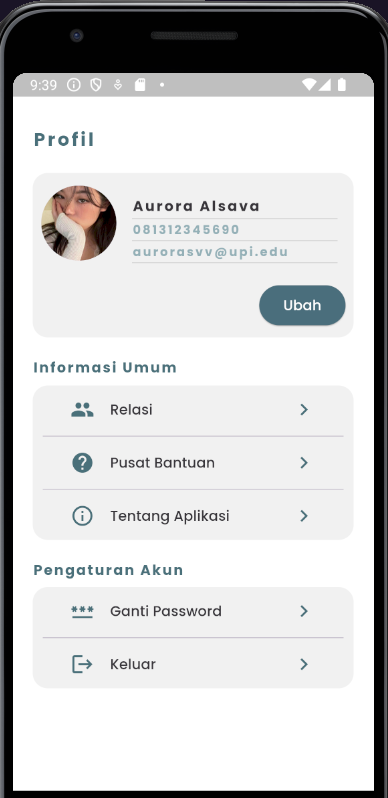

# TP2PROVIS2024C1
- Nama : Muhamad Furqon Al-Haqqi
- NIM : 2207207
- Kelas : C1
- Kelompok : 3

# Penjelasan Halaman Yang Dibuat
Halaman yang dibuat adalah halaman profil dari user dimana terdapat bagian yang menampilkan data diri dari user (nama, no. telp, dan email), beserta foto profile dari user, dan juga tombol untuk mengubah data diri.
Kemudian terdapat bagian "Informasi Umum" dimana terdapat beberapa button/menu yang dapat dipilih antara lain, Relasi, Pusat Bantuan, dan Tentang Aplikasi.
Kemudian bagian terakhir "Pengaturan Akun" terdapat button/menu Ganti Password dan Keluar.

# Dokumentasi

